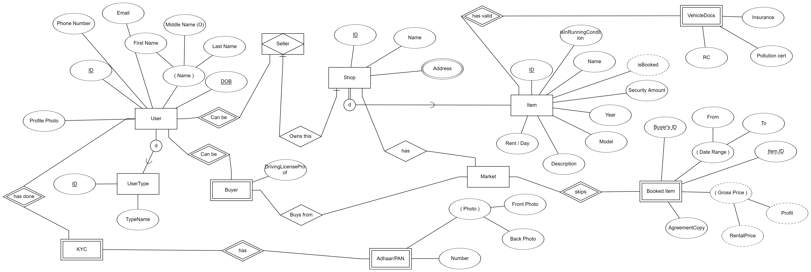

Gyvor 0.1 

> MVP tech stack 

*FrontEnd* 

- Platforms : Android, Web, iOS
- Framework: Ionic - React

*Backend* 

- DB - Firebase
- Auth - Firebase authentication
- Serverless - Google Cloud functions with NodeJS

Release Planning and Estimations

 - [x] Create data model and relations  [1day]
 - [x] Setup Serverless in AWS [spike]
 - [ ] Create UX Prototype. [1day]
 - [ ] Develop the UI with Ionic React [2–3 days]
 - [ ] System test (Alpha) [Test by the developer(s)] [1day]
 - [ ] Roll out Android app (responsive to mobile and tablet) [1day]
 - [ ] Roll out website and PWA (responsive to mobile, tab and desktop)
       [1day]
 - [ ] System testing (Beta) [Test by limited users] [1day]
 - [ ] System testing (Acceptance) [Test by end users] [1day]
 - [ ] Fix bugs and defects and roll out the final release [1 day]
 - [ ] Maintenance and regression testing [N/A]

Ref: 

[ER Diagram](https://erdplus.com/login)
> login with 
> quickroutes@gmail.com

AWS account email: raj.maharana.94@gmail.com

